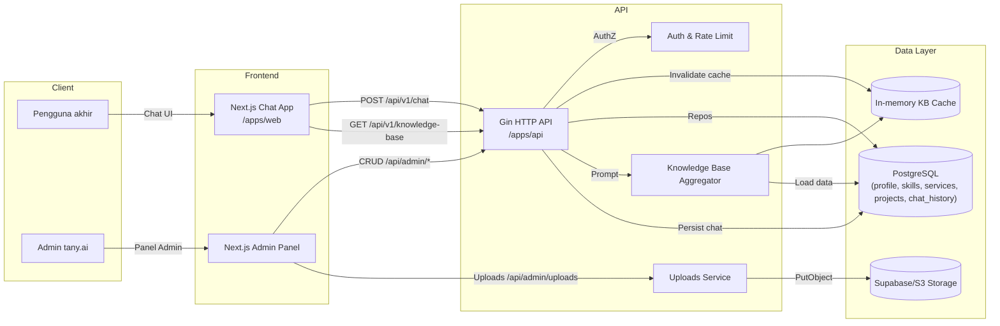

# Arsitektur tany.ai v1.0.0

Dokumen ini merangkum arsitektur end-to-end setelah fase PR-1 s.d. PR-7. Fokusnya adalah alur data dari database ke knowledge base, chat publik, panel admin, hingga integrasi CI/CD.

## Diagram Alur Sistem

## Komponen Utama

### Frontend (Next.js App Router)
- Halaman publik memuat knowledge base secara server-side dan menampilkan komponen chat dengan fallback deterministik.【F:frontend/app/page.tsx†L4-L33】【F:frontend/components/chat/ChatWindow.tsx†L1-L96】
- Panel admin menyediakan modul profil, skills, services, projects, serta uploader gambar dengan validasi form dan drag & drop.【F:frontend/app/admin/services/page.tsx†L1-L26】【F:frontend/components/admin/ServicesManager.tsx†L1-L420】
- Middleware Next.js memastikan redirect HTTPS di produksi, validasi JWT admin, dan rewrite ke halaman 403 jika role tidak sesuai.【F:frontend/middleware.ts†L1-L60】

### API Backend (Go + Gin)
- Entry point menyiapkan konfigurasi, koneksi database, server HTTP, dan structured logging JSON.【F:backend/cmd/api/main.go†L16-L55】
- Registrasi route mencakup health check, chat publik, knowledge base, auth, admin CRUD, dan upload dengan injeksi dependency & rate limiter.【F:backend/internal/server/server.go†L30-L119】
- Middleware keamanan menambahkan CSP, HSTS, X-Frame-Options, JSON logger, serta panic recovery untuk reliabilitas produksi.【F:backend/internal/middleware/security.go†L1-L15】【F:backend/internal/middleware/logger.go†L1-L23】【F:backend/internal/middleware/recover.go†L1-L19】

### Layanan Knowledge Base & Prompt
- Aggregator menggabungkan profil, skills, layanan aktif, dan proyek untuk dijadikan basis chat, lengkap dengan cache TTL dan ETag.【F:backend/internal/services/kb/aggregator.go†L19-L122】
- Prompt builder menyusun system prompt dan fallback jawaban deterministik dari knowledge base sehingga chat tetap responsif tanpa vendor LLM eksternal.【F:backend/internal/services/prompt/builder.go†L9-L104】
- Invalidation cache dipicu setiap perubahan CRUD admin (profil, skill, layanan, proyek) sehingga request berikutnya memuat data terbaru.【F:backend/internal/handlers/admin/services.go†L12-L108】【F:backend/internal/handlers/admin/profile.go†L12-L47】

### Storage & Uploads
- Storage factory mendukung Supabase maupun S3-compatible buckets berdasarkan konfigurasi environment.【F:backend/internal/storage/factory.go†L9-L63】
- Handler upload menerapkan limit ukuran, validasi MIME, sanitasi SVG, rate limit per-IP, dan log audit sebelum menyimpan objek ke storage.【F:backend/internal/handlers/admin/uploads.go†L21-L214】

### Autentikasi & Keamanan
- JWT access/refresh token dengan TTL konfigurable, cookie `__Host` refresh, dan service rate limiter per-IP untuk login/knowledge/chat/upload.【F:backend/internal/auth/jwt.go†L16-L137】【F:backend/internal/auth/ratelimit.go†L12-L68】【F:backend/internal/server/server.go†L58-L118】
- Middleware frontend memeriksa token dan role admin sebelum mengizinkan akses ke `/admin` serta otomatis logout jika token kadaluarsa.【F:frontend/middleware.ts†L16-L60】

## Alur Data End-to-End

1. **Admin memperbarui konten** melalui panel (profil, skill, layanan, proyek). Form memanggil server action yang meneruskan payload ke REST API admin.【F:frontend/app/admin/services/actions.ts†L1-L74】
2. **API admin** menyimpan perubahan ke Postgres melalui layer repository, lalu memanggil fungsi invalidate cache agar knowledge base diperbarui.【F:backend/internal/handlers/admin/services.go†L40-L108】
3. **Knowledge base** berikutnya diambil melalui `GET /api/v1/knowledge-base`, menyertakan header `ETag` & `Cache-Control` untuk efisiensi browser.【F:backend/internal/handlers/chat_handler.go†L74-L118】
4. **Chat publik** mengirim pertanyaan ke `/api/v1/chat`, API membangun prompt berbasis knowledge base, menyimpan riwayat ke tabel `chat_history`, dan mengembalikan jawaban deterministik.【F:backend/internal/handlers/chat_handler.go†L26-L70】
5. **Upload media** (avatar/gambar proyek) dikirim ke `/api/admin/uploads`, diverifikasi, lalu disimpan pada bucket Supabase/S3 dan URL publiknya disimpan bersama entitas proyek/profil.【F:backend/internal/handlers/admin/uploads.go†L21-L214】
6. **Frontend** memuat knowledge base saat rendering awal dan memperbarui snippet chat secara real-time sehingga perubahan admin langsung terlihat di halaman utama.【F:frontend/app/page.tsx†L4-L34】【F:frontend/components/chat/ChatWindow.tsx†L69-L96】

## Cache & Invalidasi
- TTL cache knowledge base dikonfigurasi via `KB_CACHE_TTL_SECONDS` dengan default 60 detik; invalidasi manual dipanggil setiap operasi CRUD admin.【F:backend/internal/services/kb/aggregator.go†L21-L68】【F:backend/internal/handlers/admin/projects.go†L48-L129】
- Header `ETag` dan `X-Cache` membantu klien mengetahui status cache (HIT/MISS).【F:backend/internal/handlers/chat_handler.go†L90-L118】

## Observability & Monitoring
- Log HTTP terstruktur (`method`, `path`, `status`, `latency_ms`, `ip`) tersedia di setiap request.【F:backend/internal/middleware/logger.go†L1-L23】
- Upload handler juga mencatat metadata file untuk audit storage.【F:backend/internal/handlers/admin/uploads.go†L130-L206】
- Response front-end menyertakan header keamanan (CSP, HSTS, Referrer-Policy) guna mencegah misuse di production.【F:frontend/next.config.ts†L15-L52】

## CI & CICD Pipeline
- Workflow `.github/workflows/ci.yml` menjalankan Go fmt/vet/test/build dengan Postgres service, lint/test/build Next.js, dan Playwright e2e (chromium) setiap push/PR.【F:.github/workflows/ci.yml†L9-L88】
- Artefak coverage backend diunggah otomatis untuk analisis QA.【F:.github/workflows/ci.yml†L47-L64】

## Skema Database Ringkas
- `profile`: informasi identitas publik AI.【F:backend/migrations/0001_init_profile.sql†L3-L15】
- `skills`: daftar keahlian terurut yang ditampilkan di prompt.【F:backend/migrations/0002_init_skills.sql†L1-L9】
- `services`: layanan dengan rentang harga, status aktif, dan urutan tampil.【F:backend/migrations/0003_init_services.sql†L1-L12】
- `projects`: portofolio dengan kategori, featured flag, dan tech stack array.【F:backend/migrations/0004_init_projects.sql†L1-L14】
- `chat_history`: rekaman percakapan (prompt hash, panjang, respons, latency).【F:backend/migrations/0009_init_chat_history.sql†L1-L15】

